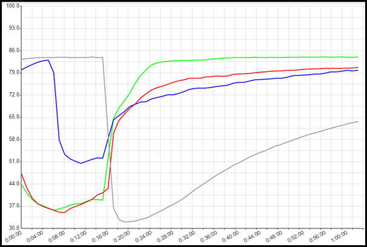
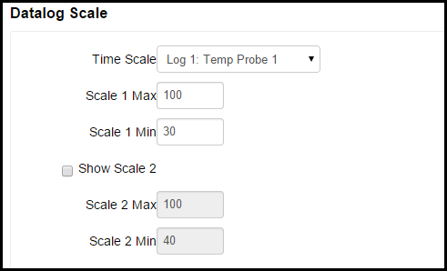
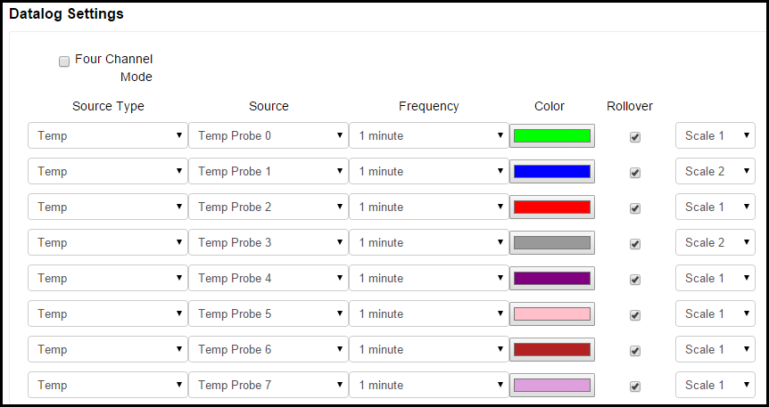

# Data Log #

The Data Log page provides graphical logging capabilities on the BCS. 

## Datalog Graph

The Datalog Graph displays temperatures and events over time. The Datalog Graph can be customized using the Datalog Scale and Datalog Settings. To reset the graph, click on the Reset Datalog button.

## Datalog Scale

The Datalog Scale section allows you to configure the temp probe that the time scale will be based on, the scale of the graph, and whether or not a second scale will be displayed on the right side of the graph.

In the **Time Scale** field, you can select which temp probe sampling time is used for the time scale on the graph. You can select the time scales for the temp probes under Datalog Settings.

In the **Scale 1 Max** and **Scale 1 Min** fields, you select the maximum and minimum temperatures to display the on the graph. If you check the **Show Scale 2** box, a second temperature scale is shown on the right side of the graph. You can then configure individual temp probes to be displayed on scale 1 or scale 2 in the Datalog Settings section.

## Datalog Settings

The Datalog Settings section allows you to customize several aspects of the Data Log graph. 

The **Four Channel Mode** check box allows you to choose how many channels for which you want to record data. By default, 8 channels are recorded and each channel can have up to 64 data points. This is based on the available memory in the BCS. If you check the box for 4 Channel Mode, data for only 4 channels will be recorded, but they will have 128 data points available. Keep this in mind when setting the Frequency for each source type and whether or not you want to Rollover data for that channel.  

Under **Source Type**, you can select the source of the data to be displayed on the graph. The choices are *Disabled*, *Temp*, *Setpoint*, *Input*, and *Output*. When *Disabled* is selected, no data will be displayed. When *Temp* is selected, the temperature for the associated Temp Probe will be displayed. When *Setpoint* is selected, the graph will display when the setpoint is reached for the associated temp probe based on the settings configured on the [Temp Setpoint Adjust](temp_adjust.md) page. When *Input* is selected, the state of the selected Discrete Input will be displayed on the graph. When *Output* is selected, the state of the output source will be displayed on the graph.

Under the **Source** column, you can select the source temp probe, output, or DIN to associate with the selection you made under the **Source Type** column. 

Under the **Frequency** column, you can select how often you want to sample data from the selected source.The choices are *1 second*, *1 minute*, *2 minutes*, *5 minutes*, *10 minutes*, *30 minutes*, or *1 hour*. 

Under the **Color** column, you can select custom colors to display for each line.

Under the Rollover column, you can select whether or not you want to rollover the data being recorded on the graph once the memory buffer is full. If the Rollover box is ***not*** selected, data for that line will only be recorded until the buffer is full. If the Rollover box ***is*** selected, the oldest data will be discarded to make room for new data.

If you chose to display 2 scales in the Datalog Scale section, you can choose which scale to use on the graph for displaying data for each line under Datalog Settings.

