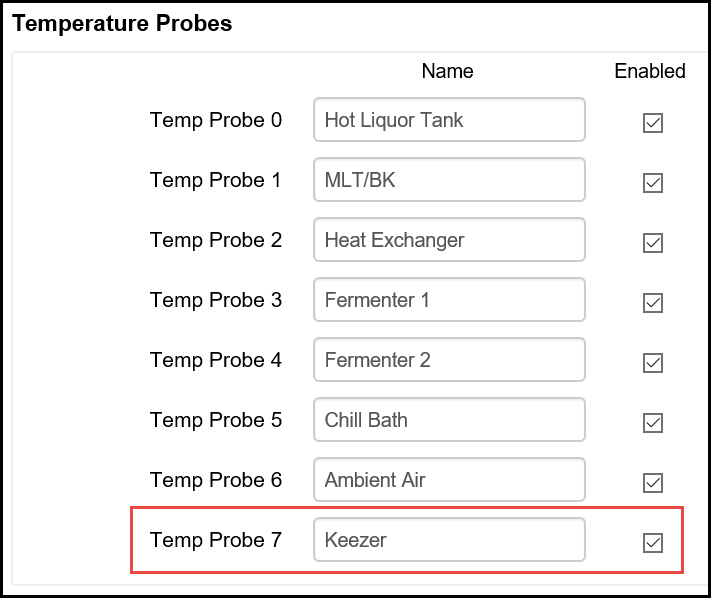
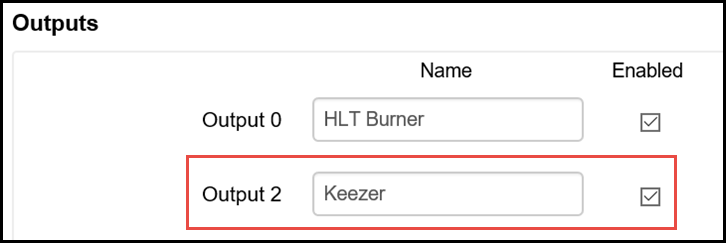
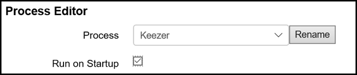
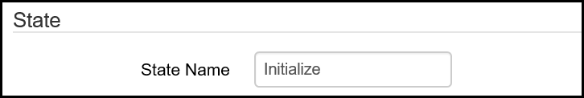
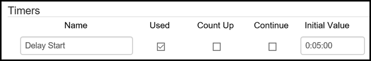
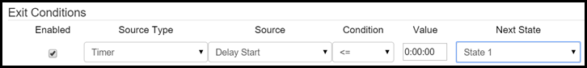
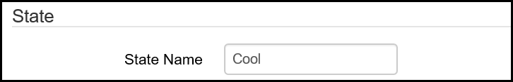
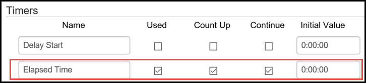

# Configuration Examples #

## Example 1 - Refrigerator Temp Control ##

This is a very simple example for controlling the temperature in a refrigerator or freezer that you are using as a kegerator or keezer (refrigerator or freezer used to store and serve beer from kegs). The same example process can also be used to control fermentation temperatures if you are using a refrigerator or freezer as a fermentation chamber. To prevent wear and tear on your refrigeration equipment, it is a good idea to use a [thermowell](http://www.brewershardware.com/Thermowells/) to protect your [temperature probe](http://www.brewershardware.com/BCS-460-Temperature-Sensors/) and submerge it in a volume of liquid (such as a gallon jug of water or inside your fermentation vessel) to prevent unwanted temperature swings and unnecessary cycling.

1. While technically optional, it is a best practice to name your temperature probes so they can be easily identifiable by location or function rather than number. From the [Settings](settings.md) page, go to the Temperature Probes section and name and enable any temperature probes you are going to use in your BCS deployment. In this case, Temp Probe 7 is has been named Keezer and it has been enabled. For examples of how to connect the temp probes to the BCS, see the [Wiring Examples](wiring.md) page.

2. The next step is to name your output that will control your refrigerator or freezer. From the [Settings](settings.md) page, go to the Outputs sections to name and enable the output that will control the power supply to the refrigerator. In most cases, this will be a solid state relay (SSR). For examples of how to connect an SSR to the BCS, see the [Wiring Examples](wiring.md) page.

3. Now that you have named and enabled your temp probe and your output, you can configure the process to control your refrigerator. Go to the [Process Editor](process_editor.md) page on the BCS interface. Select an unused process from the pulldown menu. Click on the **Rename** button and enter a new name for your process so that it can be identified. In this case, the process is named *Keezer*. For this process, it is a good idea to check the **Run on Startup** box. This enables this process to start automatically when the BCS powers up. If the BCS temporarily loses power, the process will begin automatically so you don't come home to warm beer.

4. From the **State** pulldown menu, choose **State 0**. Also, choose to dislay this process when it is running to show the process on the Main Control page.

5. State 0 will be the initial state of this process when it begins. Since you are choosing to start this process when the BCS starts up, you want to build in some protection for your refrigerator if there is an instance when the power to the BCS becomes unreliable due to blackouts or brownouts. To do this, you will create an initialization period that will cause the BCS to wait 5 minutes before it enters the next state which will actually control the temperature. In the State section, enter the **State Name** of **Initialize**.

6. Go to the **Timers** section to setup the delay timer. Enter a name for the delay timer, check the **Used** box, and set the initial value to 5 minutes. Because you did not check any other boxes, this will be a countdown timer.

7. Once your delay timer expires, you want to start the state that will be responsible for controlling the temperature. To do this, go to the **Exit Conditions** section. On the first exit condition line, check the **Enabled** box. Choose **Timer** as the **Source Type**. For the **Source**, select the name of the delay timer that you configured in the previous step. For the **Condition**, select "**<=**". Leave the **Value** as as 0:00:00. Select **State 1** as the **Next State** (you will configure that next).

8. Scroll to the top of the Process Editor page and select **State 1** in your *Keezer* process. Name this state **Cool**. 
.

9. In the **Timers** section, add a timer for this state that will show how long this state has been running. Name the timer **Elapsed Time** and check the **Used**, **Count Up**, and **Continue** boxes. Leave the **Initial Value** as **0:00:00**.
.

10. In the **Output Control (Configurable)** section, configure your Keezer output to maintain the temperature you desire. Earlier, you configured an output and a temp probe with easy to remember names and now it is time to put those to use. From the Keezer line (or whatever name you created earlier), choose **Hysteresis** in the **Mode** column. Select **Cool** in the **Heat/Cool** column. Select Keezer as your Temperature Probe. Enter your temperature **Setpoint** and your **Swing**. The Setpoint is your target temperature. In Cool mode, the Setpoint is the lowest temperature you want to reach. The Swing determines how many degrees above (in Cool mode) the setpoint the temperature will be allowed to be before the output is triggered to begin cooling the refrigerator. In this example, a Setpoint of 35 and a swing means that the temperature will be maintained between 35 and 37 degrees. 
.

11. You can optionally configure another state that will sound an alarm if the Setpoint is exceeded. The Exit Condition for that state will be to return to the Cool state.

## Example 2 - Fermentation Control ##

## Example 3 - Mashtun Temp Control ##