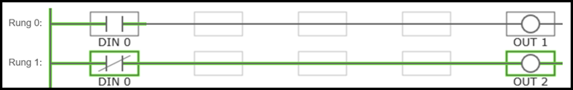
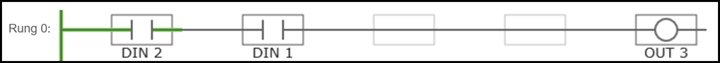
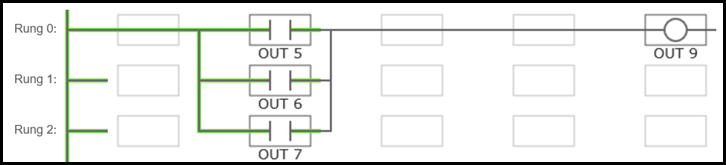
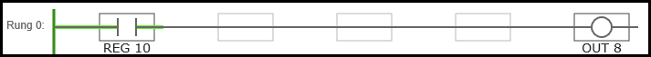
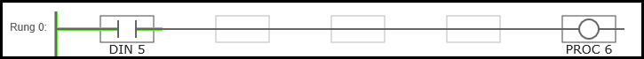

# Ladder Logic #

While programming processes can provide a robust method for programming complex interactions on the BCS, sometimes it is more efficient to use low level programming. That is what ladder logic provides. You do not have to use ladder logic, but if you do it supersedes any processes that have been configured. In addition, unlike processes, ladder logic is always running when the BCS is powered on.

## Ladder Logic Defined

Ladder logic is based on Boolean functions such as AND and OR. Each rung has five slots. The first four slots are contacts and the last column is a coil. The coil slot is the result of the logic configured in the first four slots. Each slot must be filled with either a Process, Input, Output, Register, or Contact. The slots are connected to each other using Wires. Rungs are in groups of four. Rungs in the same group can be connected using wires. Rungs in different groups cannot be connected directly, but can be connected using Registers (explained below). When changes are made to the ladder logic, they are automatically saved and applied immediately.

### Wires

Wires are used to connect slots. In order for ladder logic to work, all the slots in a rung must be filled and all the slots must be connected using a wire. When a single rung is connected all the away across from left to right, the relationship between the slots is a logical AND. Slots can also connect via wires to slots above or below as long as they are in the same four rung group. When slots are connected vertically, the relationship between the slots is a logical OR. 

There are several different wire types to choose from to connect slots both horizontally and vertically. To add a wire between slots, simply drag and drop the desired wire from the right side menu to desired location on the ladder. To clear a previously applied wire connection, drag and drop the blank wire icon to the desired spot.

### Contacts

Contacts are used to fill slots when you do not need a register, DIN, output, or process to fill that slot. Remember, every slot in the rung must be filled with one of these variables, so contacts are very useful. To add a contact to a slot, simply drag the contact to the desired slot. To clear the contact, drag the blank contact icon to the slot.

### Registers

Register are internal virtual switches on the BCS. Registers can be normally open (NO) or normally closed (NC). Since registers are virtual switches, their status can be used to control other register, outputs, and processes. Registers can also be used to extend ladder logic between rungs, even if they are in another rung group. There are sixteen available registers, numbered 0-15. For more information on how registers can be used, see the examples later in this section.

### Inputs

Inputs are the external discrete inputs (DINs) connected to the BCS. In ladder logic, each DIN can be either normally open (NO) or normally closed (NC). The dispostion of a DIN can control the status of registers, outputs, or processes. An input cannot be placed in the coil position. A common use of an input would be to use an external button or switch that in turn controls an output that will turn a pump on or off through ladder logic. For more information on how inputs can be used, see the examples later in this section.

### Outputs
An output can be placed in a contact position (columns 1-4) or a coil position (column 5). Each output is available as normally open (NO) and normally closed (NC). While outputs are normally thought of as coils, they can also be used as contacts. See the examples below for more information. If the output is placed in the coil position and all the conditions are met in the contacts, then the output will either be turned on (NO) or off (NC).

### Processes

Like outputs, processes can also be placed in either contact or coil slots on the ladder. This behavior is useful is you want to use one process to start or stop another process. Processes can also be started or stopped using and input. Each process is available as running (NO) or stopped (NC).  For more information on how processes can be used, see the examples later in this section.

## Examples ##
Below are some common configuration examples using ladder logic. Use the examples below to help build out your ladder logic based on how you use your BCS. Remember, ladder logic takes precedence over any processes that are running. If you have a process running that has an output turned off, but that same output is turned on in ladder logic, then the output will be turned on.

### Example 1 - Controlling Two Outputs with One Input
In this example input 0 (DIN 0) is used to control two different outputs - OUT 1 and OUT 2. In the normally open position on Rung 0, OUT 1 will be turned on. On Rung 1, when DIN 0 is in the normally closed position, OUT 2 will be turned on. In this example, the first column is populated with the appropriate input. The spaces between the columns are filled with wires, and the desired output is placed in the last, or coil, position.

### Example 2 - Logical AND
To create a logical AND function between two or more variables, place them in series. In the example below, if both DIN 1 and DIN 2 are NO, the OUT 3 will be NO (or turned on).

### Example 3 - Logical OR
To create a logical OR between variables, place them in parallel. In the example below, if either output 5, 6, or 7 is on, then output 9 will also be on. In this particular example, outputs 5, 6, and 7 are all motorized ball valves that control the flow of coolant in a jacketed conical. Output 9 is a pump the circulates the coolant. The result of this ladder logic is that if any of the ball valves are open, then the pump will turn on. The valves are controlled by a process that is configured to control the fermentation temperatures of the jacketed conicals.

### Example 4 - Alarm To Register 10
Another option is to use Register 10 to sound an alarm. This can be configured on the [Settings](settings.md) page under General Settings by checking the **Alarm to Register 10** box. This will activate Register 10 any time an alarm is set to sound as a result of processes. In this example, NO Register 10 is in the first slot and is connected via wires and contacts to NO Output 8 in the coil position. When Register 10 is turned on, Output 8 is turned on.

 

### Example 5 - Starting a Process With an Input
In this example, you can connect a two-way switch to a DIN to start or stop a process.

