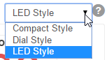

# Main Control #

The Main Control is the primary page used for controlling processes, observing temperatures, as well as controlling inputs and outputs.

## Current Temperatures

The Current Temperatures are displayed here for all active temperature probes. Temperatures can be displayed in three different styles - LED, Dial, or Compact. The display style is chosen using the pull-down menu in the upper right corner of the screen.

The names of the temperature probes and whether or not a probe is active can be customized on the [Settings](settings.md) page.

## Processes

The Processes section displays all running processes. The current state of the process is shown in green. In addition, processes can be manually paused or manually put into another state. A process is simply a series of states that are strung together. States are the basic building blocks of BCS programming. States can contain timers, temperature set points, trigger other processes, trigger alarms, and control outputs such as pumps, valves, and burners. Each process can have up to eight states. Processes and their associated states can be configured on the [Process Editor](process_editor.md) page.

## Outputs

The Outputs section displays the enabled outputs. Asserted outputs are shown in green. You can also manually turn outputs on and off by clicking on the name of the output. An output is simply any device that can be turned on and off by the BCS like a valve, pump, or solid state relay (SSR). The output numbers  in the BCS interface correspond to the output numbers physically shown on the BCS box. The names of the outputs and whether or not an output is enabled can be configured on the [Settings](settings.md) page.

## Inputs

The Inputs section displays the enabled discrete inputs (DINs) on the BCS. Inputs that are currently active will be displayed in green. Inputs can be configured on the [Settings](settings.md) page.

