# Process Editor #

The Process Editor page is where most of the configuration on the BCS happens. You can configure up to 8 processes with 8 states on each process. The status of processes, states, and timers are displayed in the Processes section of the [Main Control](main_control.md) page.

**Editing processes and states while they are running may produce erratic or undesirable results.**

## Editing a Process

You can give a process a new name by clicking the **Rename** button. Simply type in the you desire and hit the **Enter** key to save your changes.

To run a process when the BCS starts up, check the **Run on Startup** check box. This setting is useful for applications like maintaining the temperature in a refrigerator or kegerator. If the BCS were to reboot because of a power failure, it would automatically start the process to continue maintaining the temperature when power is restored. For an example of this configuration, see the [Configuration Examples](examples.md) page.

The **Display** pulldown menu allows to choose when the process is shown on the [Main Control](main_control.md) screen. Your choices are When *Running*, *Always*, and *Never*.

The **State** pulldown menu allows you to choose which state you want to edit. Once you select a state, the state editing section will display on the this page.

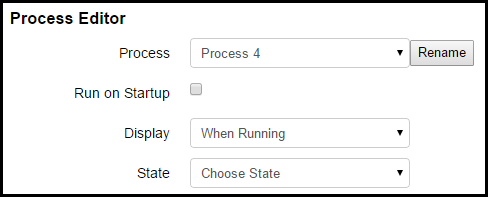

## Editing a State ##

When you select a state to edit, the state editor opens which contains several different sections.

### State ###

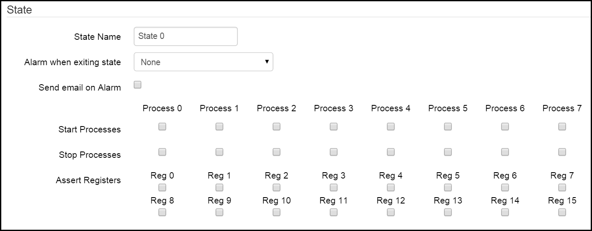

In this section, you can give the state a name. For instance, if the purpose of the process is to set and hold a mash temperature, you might call this state "Hold Mash Temp". To change the state name, click in the **State Name** field and type the name you desire. The name will be automatically saved when you hit the **Enter** key or the **Tab** key.

You can set an alarm to sound when the state is exited by choosing one from the **Alarm when exiting state** pulldown menu. Your choices are *None*, *Short*, and *Loop*. If you choose *None*, no alarm will sound. A *Short* alarm will only sound for 6 seconds. A *Loop* alarm will sound until you turn it off.

The **Send email on Alarm** check box enables an email to be sent when the alarm is triggered. The destination email address can be configured on the [Settings](settings.md) page.

From the **Start Processes** row, you can choose which other processes you want to run when the state exit condition occurs. This is useful for chaining processes like starting your boil process when a certain mash state is exited.

From the **Stop Processes** row, you can choose which processes you want to stop when the state exit condition occurs.

From the Assert Registers row, you can utilize any ladder logic registers that you have configured on the [Ladder Logic](ladder_logic.md) page. When you check the box to assert a register, that register will be turned on  (or asserted) when the state is active.

### Timers ###

The Timers section allows you to configure up to four timers to be associated with the state. The status of the timers will be displayed on the [Main Control](main_control.md) page if enabled.

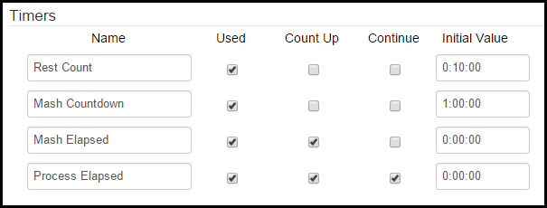

The **Name** column allows you to configure custom names for your timers. To change the name of the timer, type in the name you desire and hit the **Enter** key. The **Used** checkbox column allows you to designate whether or not the timer on that line will be used in the state. The **Count Up** column allows you to configure whether the timer will be a *count down* or *count up* timer. The **Continue** column allows to configure whether or not the timer will continue counting from the previous state. An example of continuing the timer would be a mash timer that transitions from the mash state to a recirculation state, but you want the timer to keep running. When the continue box is checked, the Initial Value field is not used. The **Initial Value** column is used to configure the starting amount of time for the timer. Time is expressed as H:MM:SS. Typically, the starting value for Count Up and/or continuous timers is 0:00:00. Count Down timers are configured for the amount of time you desire. As an example, a one hour mash timer would be configured as a Count Down timer and the value would be 1:00:00.

### Ramp Mode ###

Ramp mode allows you to program a rise or drop in temperature over time. This function is useful for dropping fermentation temperatures over time. As an example, a state that contains a ramp mode to cold crash a fermentor could be triggered after another timer based state that controlled the temperature during active fermentation.

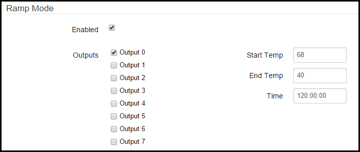

To enable ramp mode, check the **Enabled** box. You can associate the ramp mode profile with one or more outputs. To enable an output, check the box next to the output you want to enable. Use the **Output Control (Configurable)** section to associate the chosen output(s) with temp probes, SSRs, pumps, valves, etc. *If you are using ramp mode, your ramp mode temperatures will override any temperature settings that you configure for an associated output in the **Output Control (Configurable)** section.* Enter your starting temperature for ramp mode in the **Start Temp** box. Enter your finishing temperature in the **End Temp** box. Remember, you can use ramp mode to raise or lower temperatures over time. It all depends on your configuration and application. Enter the time over which you want to ramp from your starting temp to your end temp in the **Time** box. The time is expressed as HH:MM:SS.

### Output Control (Configurable) ###

This section allows you to control the variables associated with outputs 0-7 for the selected state. 

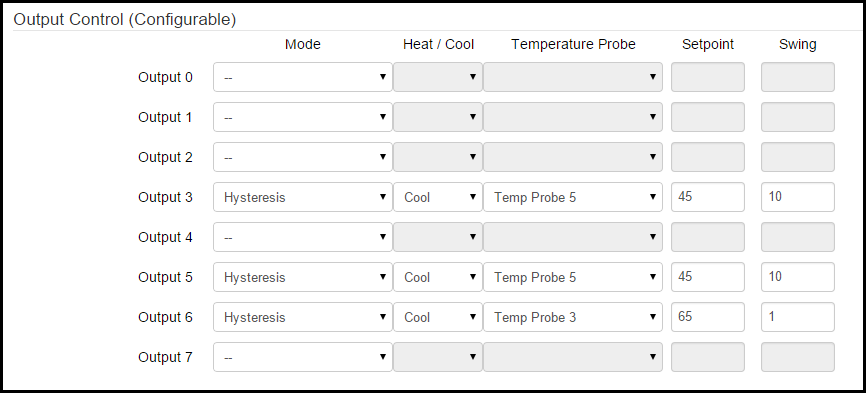

For each listed output (number of outputs is different for the BCS 460 and the BCS 462) you are presented with several options. The **Mode** column,the choices are *Direct*, *Duty Cycle*, *Hysteresis*, and *PID*. 

#### Direct Mode ####
In *Direct* mode, the choices are to have the output either *on* or *off* when the state is active. When *Direct* mode is chosen, choose either the on or off radio button in the **Setpoint** column.

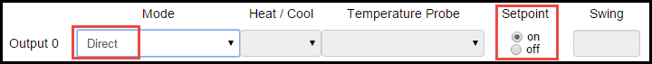

#### Duty Cycle Mode ####
*Duty Cycle* mode is most useful for electric heating elements since they are more suited to cycling through numerous on/off cycles. This is as opposed to a freezer compressor which can be worn out in short order when cycled on and off multiple times in a short time frame. In Duty Cycle mode, the **Setpoint** column is used to set the percentage of time of the duty cycle that the output will be turned on. The duty cycle setpoint is a percentage of the configured **Output Period** that is configured for the selected output under **PID Settings** on the [Settings](settings.md) page.

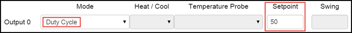

#### Hysteresis Mode ####
*Hysteresis* mode is used to maintain temperatures at a setpoint with an allowable amount of temperature swing above and/or below the setpoint. In *Hysteresis* mode, you can select whether the output will be used to **Heat** or **Cool** from the **Heat/Cool** pulldown menu. You can also select which **Temperature Probe** is used to measure temperature. Enter the desired **Setpoint** temperature. By default, the temperature is measured in Fahrenheit. The temperature setting for the BCS can be changed to Celsius on the [Settings](settings.md) page. The **Swing** field is used to set that acceptable amount of temperature swing from the setpoint. In this example, a setpoint of 68 in Cool mode and a swing of 2 would result in the output to turn on at 70 and keep running until the temperature reached 68. Depending on use and outside factors (like ambient air temp), you will need to decide what the acceptable swing is balanced with the cycling of your heating or cooling system.

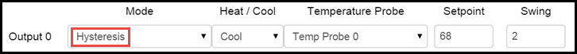

#### PID Mode ####
*PID* mode is able to provide a tighter temperature range variance than *Hysteresis* mode, but is not suitable for all applications. For instance, *PID* mode is not always suitable for controlling a freezer or refrigerator since it may cause the compressor to cycle too often. *PID* stands for proportional-integral-derivative. The *PID* algorithm is able to maintain a tighter temperature range without over-shooting the target temperature. The PID settings can be customized on the [Settings](settings.md) page.In *PID* mode, you can select whether the output will be used to **Heat** or **Cool** from the **Heat/Cool** pulldown menu. You can also select which **Temperature Probe** is used to measure temperature. Enter the desired **Setpoint** temperature. By default, the temperature is measured in Fahrenheit. The temperature setting for the BCS can be changed to Celsius on the [Settings](settings.md) page. 

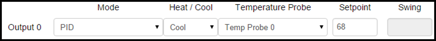

### Output Control (Direct On/Off) ###

This section allows you to directly turn outputs on or off when the state is active. This is useful for turning pumps on or off during mash recirculation or opening or closing glycol valves during fermenation. *This functionality is only available on the BCS 462*. To control an output, select the **Enabled** check box for the desired output. When an output is Enabled, you can then select whether the output will be on or off using the **On/Off** pulldown menu.

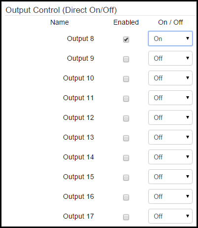

### Exit Conditions ###

This section allows you to configure conditions that will cause the state to end. You can configure up to four exit conditions. The state will exit when any of the enabled conditions are met. To enable an exit condition, select the check box next to the exit condition row in the **Enabled** column. In the **Source Type** column, you can choose *Temp Probe*, *Timer*, or *Digital Input*. 

If the **Source Type** is *Temp Probe*, you can choose which temp probe to use under the **Source** column. Under the **Condition** column you can choose greater than or equal to (>=) or less than or equal to (<=). Under the **Value** column you can enter the desired temperature for the exit condition. By default, the temperature is measured in Fahrenheit. The temperature setting for the BCS can be changed to Celsius on the [Settings](settings.md) page. In the **Next State** column you can choose what happens after the state exits. The choices are another state (*State #*), *Wait for Input*, or *Stop Process*. If you choose to exit to another state, that state will begin (the next step in brewing process, crash cool, etc.). If you choose *Wait for Input*, the process will continue, but you will be alerted that manual intervention is necessary. If you select *Stop Process*, the current process will end.

If the **Source Type** is *Timer*, you can choose which timer to use under the Source column. Under the **Condition** column you can choose greater than or equal to (>=) or less than or equal to (<=). Under the **Value** column you can select the timer value (this will vary depending on if you selected a count down or count up timer). The time is expressed as H:MM:SS. In the **Next State** column you can choose what happens after the state exits. The choices are another state (*State #*), *Wait for Input*, or *Stop Process*. If you choose to exit to another state, that state will begin (the next step in brewing process, crash cool, etc.). If you choose *Wait for Input*, the process will continue, but you will be alerted that manual intervention is necessary. If you select *Stop Process*, the current process will end.

If the **Source Type** is *Digital Input*, you can choose which DIN to use (as an example, this could be a push button or a toggle switch). In the **Value** column you can choose either *on* or *off* for the DIN. In the **Next State** column you can choose what happens after the state exits. The choices are another state (*State #*), *Wait for Input*, or *Stop Process*. If you choose to exit to another state, that state will begin (the next step in brewing process, crash cool, etc.). If you choose *Wait for Input*, the process will continue, but you will be alerted that manual intervention is necessary. If you select *Stop Process*, the current process will end.

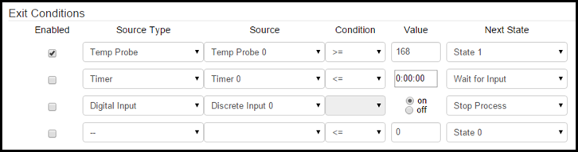