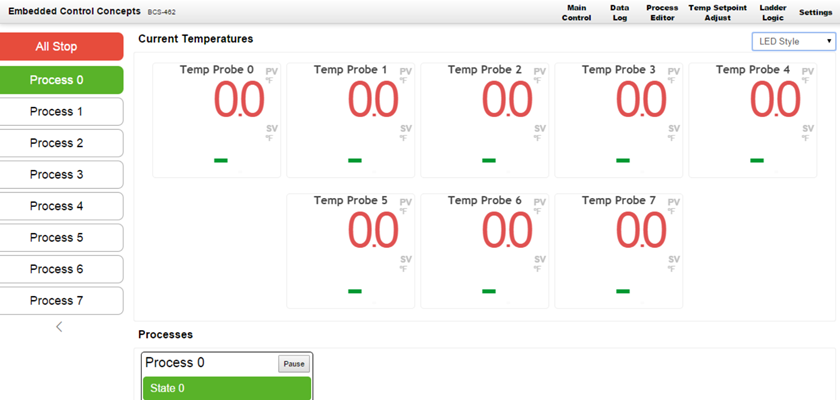
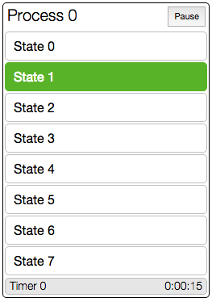
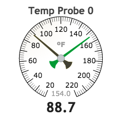
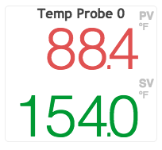
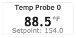
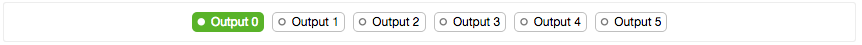
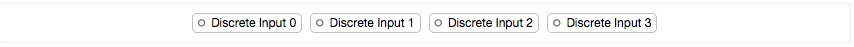

## Help Links
By default, every section on the BCS UI has a ? next to it which contains a link to the relevant section in the manual.  This can be turned off using the Toggle Help link at the bottom of every page.

## Process Bar

The Process Bar appears on the left hand side of all pages in the BCS interface so you can always see which processes are currently running and provides access to the All Stop button.

 

Processes can be started or stopped by clicking the process in the process bar.  The All Stop button will stop all processes and turn off all outputs that are currently on even if they are not being controlled by a process.

The < link below the process bar can be used to hide the process bar if it is not needed.  This can help with space restrictions on smaller screens.

## Control UI

The Control UI is the main interface for using the BCS. It displays the current temperature for all enabled temperature probes, information on running processes, the current status of all enabled outputs and inputs.

*Above: Control UI with a running processes*

### Processes

Running processes will be shown directly on the Control UI.  Processes can also be set up with an option so they are always displayed.

The process can be paused or resumed using the button in the upper right hand corner.

The state can be changed directly by clicking on the desired state in the process section.

Clicking the name of the process will stop (or start) the process.

### Temperatures

The BCS offers 3 options for viewing the current temperatures.

Style         | 
------------- | ------------------------------------
Dial Style    | 
LED Style     | 
Compact Style | 

*The compact style is great on mobile devices!*

### Outputs
Displays the current state of the outputs.

Outputs can be manually controlled by clicking on them in the Control UI, but any running processes or ladder logic will take precedence.

### Inputs
Displays the current state of the inputs.

