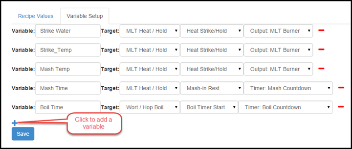
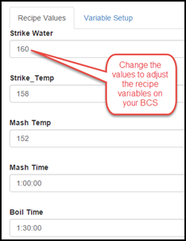
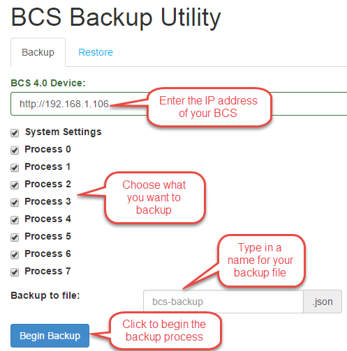
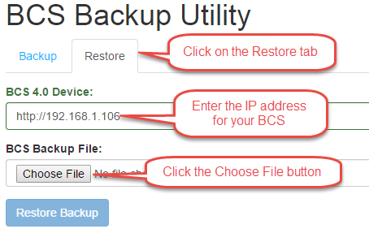
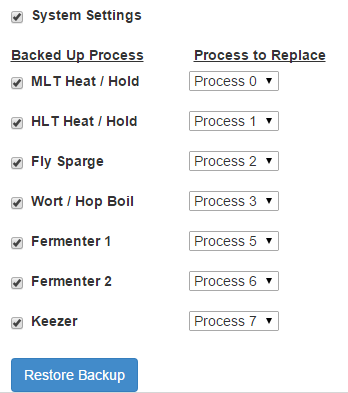

# Online Utilities 

## Recipes
The [Recipes utility](http://embeddedcc.github.io/bcs-recipes/) allows you to quickly reconfigure your BCS processes/states with new temperatures and times without having to edit each process/state.  You can create variables such as strike water temperature, mash temperature, mash time, etc.  You can then quickly change these values and the utility will update each location within your BCS programming where you are using that variable.  
On the **Variable Setup** tab, click the "**+**" icon to add a new variable.  You need to assign a name to the variable and then select the process, state and item that the variable will be updating.  Click the **Save** button to save your changes. If you have a temperature such as your strike water temperature that is used in multiple places (e.g. heat to 168 and exit that state when 168 is met), you can define both entries using the same variable name.  This will make it so you only need to enter the value once, but it will change it in multiple locations (see examples below).

Once your variable definitions are created, you only need to utilize the **Recipe Values** tab when you want to change the values.  Common things to put in the variables include strike temp, sparge temp, mash temp, mash time, and boil time.

## Backup/Restore
The [Backup/Restore utility](http://embeddedcc.github.io/bcs-backup/) allows you to save your settings and/or your processes to a local drive on your computer. **The Backup/Restore utility only works when Authentication is disabled on the BCS. Authentication can be disabled on the [Settings](settings.md) page.**

### Backup
To backup your configuration, click on the Backup/Restore tab at the top of the screen.

Enter the IP address for your BCS. The utility will locate your BCS and display the elements that are available for backup. Choose which settings you want to include in the backup by checking or unchecking the check boxes. The **System Settings** include any custom settings you have configured such as custom names for temperature probes and processes. The **Processes** are the actual processes you have configured on your system.

Enter a name for the backup file. Click the Begin Backup button. The backup file creation will take a minute to complete. Select a location on your local machine where you want to save the file to finish the process.

### Restore
To restore from a previously save configuration, click on the Restore tab. Enter your BCS IP address. Click the **Choose File** button and open the configuration file from which you want to restore. Click on the **Restore Backup** button.

Once the utility reads the file, you can choose to restore the Settings and/or individual processes. In addition, you can map the processes in the backup file to different process numbers on your BCS. Once you are satisfied with your choices, click the **Restore Backup** button to complete the process. The restore process will take a few minutes to complete. Once the restore process has completed, you need to reset the BCS for the changes to take effect. Go to the [Settings](settings.md) page and click on the **System Reset** button.

## 3.x Config Migrator
The [Config Migrator](http://embeddedcc.github.io/bcs-config-migrator/) allows you to import your existing BCS 3.x configuration into 4.0. To begin, you must first have a 3.x backup file. 

Navigate to the 3.x Migrator utility. Enter the IP address of your BCS. Click on the **Choose File** button and select your 3.x backup file. Click on the Begin Migration button. Once all the configuration parameters are shown as **Done**, you can close the progress window.  Once the migration process has completed, you need to reset the BCS for the changes to take effect. Go to the [Settings](settings.md) page and click on the **System Reset** button.

## PID Tuner

The [PID Tuner](http://embeddedcc.github.io/bcs-pid-tuner/) is used to calibrate the proportional, integral, and derivative gains of the BCS. This is normally not necessary, but the functionality has been built into the utility to accommodate the need for fine tuning the PID settings.

The normal PID settings are automatically tuned for the temperature probes that are available for the BCS from retailers like [Brewers Hardware](http://www.brewershardware.com). These setting are shown on the [Settings](settings.md) page of the UI.
